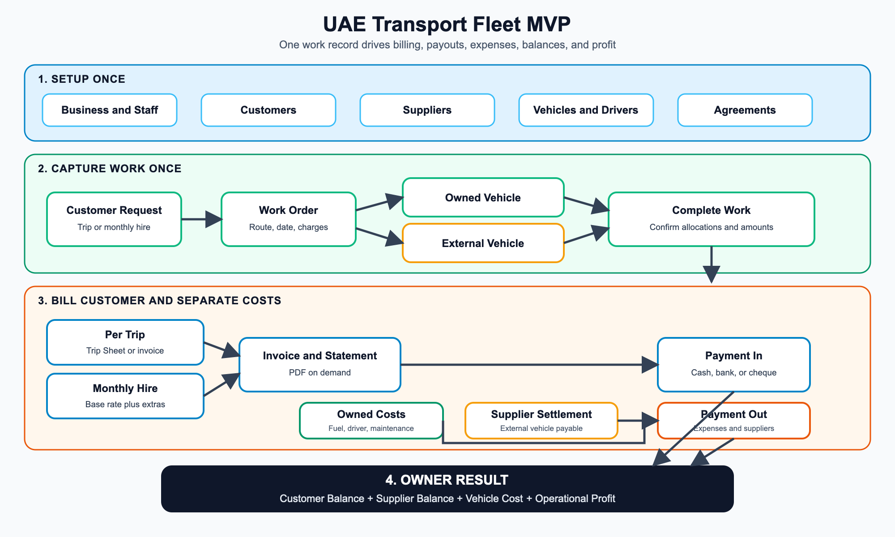

# UAE Transport Fleet Management MVP

Product and System Blueprint

Version: 1.0  
Status: Ready for client validation  
Market: United Arab Emirates  
Pilot: One transport operator, one location  
Platforms: Flutter for Android and iOS

## 1. Executive decision

Build one small operations and money app for the current client workflow.

The app replaces paper, Excel, manual totals, scattered payment notes, and repeated invoice preparation. The app follows every amount from customer work through billing, collection, outside-vehicle payment, owned-vehicle expense, and operational profit.

The MVP does not attempt full fleet tracking, payroll, accounting, GPS, subscription billing, or multi-country compliance.

Success means the owner finishes the month without rebuilding the business in Excel.

## 2. Product goal

The owner needs one place to answer six questions:

1. What work did we perform?
2. Which vehicle and driver performed the work?
3. Was the vehicle owned or supplied by someone else?
4. How much should the customer pay?
5. How much do we owe drivers, suppliers, and vehicle expenses?
6. What operational profit remains?

## 3. Current workflow

The client runs two main service models.

### 3.1 Fixed monthly vehicle hire

A company hires a vehicle for a month. The agreement defines a base rate, duty days, hours, vehicle, driver responsibility, fuel responsibility, and maintenance responsibility.

The agreement can also store preset amounts for recurring extra charges, such as parking, so staff do not retype the same amount every month.

The monthly invoice adds charges such as:

- Sunday or extra-day work.
- Overtime.
- Extra trips.
- Night shift.
- Parking.
- Toll or gate pass.
- Other approved charges.
- VAT where applicable.

### 3.2 Per-trip transport work

A company requests one or more vehicles for transport work. The client records the date, route, customer, vehicle size, driver, invoice number, rate, VAT, toll, unloading, gate pass, and total.

The client sends a trip document or invoice after the work. At month end, the client sends a statement listing all work and totals. The customer compares the statement with trip documents before issuing payment.

### 3.3 Mixed vehicle supply

The client owns a limited fleet. A larger request uses owned vehicles and vehicles supplied by friends, rental owners, or subcontractors.

The customer deals only with the client. The client receives the full customer payment, then pays outside vehicle owners. Some work has margin. Some work passes the full amount to the outside owner.

The MVP treats every outside source as a supplier. Each external vehicle allocation stores the payable amount. This one rule covers rented, borrowed, friend, and subcontracted vehicles.

## 4. MVP scope

### Included

- Business profile and document branding.
- Owner and staff accounts.
- Customers and suppliers.
- Owned and external vehicles.
- Managed driver profiles.
- Per-trip and monthly-hire agreements.
- Work orders with multiple vehicle allocations.
- Customer charge lines.
- Supplier payable amounts.
- Fuel, maintenance, driver, toll, parking, rent, and other expenses.
- Trip sheets, tax invoices, monthly statements, and supplier settlements.
- Incoming and outgoing payments.
- Partial payment allocation.
- Customer and supplier balances.
- Operational profit reports.
- Vehicle and driver document-expiry dates.
- Opening-data import.
- On-demand PDF generation and native mobile sharing.

### Excluded

- Driver login.
- Pickup, drop, and in-transit actions.
- Live location and GPS hardware.
- Full offline editing.
- Full payroll and WPS export.
- General ledger and bank reconciliation.
- Percentage commission rules.
- Receipt-image storage.
- Web dashboard.
- Multi-branch operation.
- Self-service tenant signup.
- SaaS subscription billing.
- KSA support.
- UAE Accredited Service Provider integration.
- Drag-and-drop document designer.

## 5. Users and permissions

### Owner

The owner has full tenant access. Only the owner manages staff, business settings, document sequences, exports, void actions, and backup operations.

### Staff

The owner assigns one or more access packs.

| Access pack | Rights |
|---|---|
| Operations | Create, edit, complete, cancel, and view work orders and vehicle allocations. View required customer, vehicle, driver, and agreement details. |
| Master Data | Create, edit, archive, and view customers, suppliers, vehicles, drivers, and agreements. |
| Money | Manage charge lines, invoices, expenses, payments, supplier settlements, balances, and profit. |
| Reports | View, generate, export, and share approved reports and documents. |

Settings and staff control remain owner-only.

### Driver

The MVP stores drivers as managed profiles. Drivers receive no account or app access.

## 6. Business terms

| Term | Meaning |
|---|---|
| Customer | Company receiving transport service and paying the operator. |
| Supplier | Outside vehicle owner or company receiving a payout. |
| Agreement | Customer terms, rate model, responsibility, and billing rules. |
| Work Order | One customer request or one unit of transport work. |
| Vehicle Allocation | One owned or external vehicle assigned to a work order. |
| Trip Sheet | Per-trip proof and charge record. |
| Monthly Hire | Fixed monthly vehicle service with base and extra charges. |
| Invoice | Issued customer financial document. |
| Monthly Statement | Period list of work or invoices for customer review. |
| Supplier Settlement | Period list of outside vehicle work and payable amounts. |
| Expense | Operator cost for fuel, maintenance, driver, toll, parking, rent, or other work. |
| Payment Allocation | Part of a payment applied to an invoice, expense, or settlement. |
| Operational Profit | Net customer revenue minus supplier payables and linked operating expenses. |

## 7. Main app structure

The app uses four main areas.

### Home

- Current-month billed revenue.
- Money received.
- Money paid.
- Customer receivables.
- Supplier payables.
- Operational profit.
- Work awaiting billing.
- Cheques awaiting clearance.
- Vehicle and driver documents nearing expiry.
- Quick actions for Work, Payment In, Expense, and Payment Out.

### Work

- Planned, completed, canceled, and billed work.
- Search by customer, date, driver, vehicle, route, invoice number, or status.
- Add per-trip work.
- Add monthly-hire extra charge.
- Prepare monthly billing.
- Duplicate previous work.

### Money

- Customer invoices.
- Monthly statements.
- Incoming payments.
- Supplier settlements.
- Expenses and outgoing payments.
- Customer balances.
- Supplier balances.
- Profit reports.

### More

- Customers and suppliers.
- Vehicles and drivers.
- Agreements.
- Reports.
- Staff and access packs.
- Business identity and document branding.
- Opening data and owner export.

## 8. End-to-end flow

The same work record feeds customer billing, outside supplier payables, owned-vehicle expenses, payments, balances, and profit. Staff should never enter the same trip in separate finance and operations screens.

## 9. Setup records

### 9.1 Business profile

Required fields:

- English legal name.
- Arabic legal name, optional.
- Trade licence number and type.
- TRN or TIN where applicable.
- Address, city, and country.
- Phone and email.
- Default currency, fixed to AED for the pilot.
- Default VAT rate, set to 5 percent.
- Logo.
- Header artwork, optional.
- Brand color.
- Footer and payment instructions.
- Invoice prefix and opening sequence.

### 9.2 Party

One party record supports customer, supplier, or both.

Fields include legal name, display name, address, city, country, TRN or TIN, trade licence, contact person, phone, email, payment terms, active state, and notes.

### 9.3 Vehicle

Fields include plate number, internal label, vehicle class, capacity, make, model, year, owned or external source, linked supplier, registration expiry, insurance expiry, inspection expiry, active state, and notes.

An external vehicle needs a supplier. Plate number stays optional when a supplier sends an unregistered temporary vehicle.

### 9.4 Driver

Fields include name, phone, licence number, licence expiry, Emirates ID or other identity reference, identity expiry, employed or external classification, linked supplier where relevant, active state, and notes.

### 9.5 Agreement

Every work order links to a customer and agreement.

Agreement fields include:

- Name and reference.
- Customer.
- Start and end dates.
- Rate model, per trip or monthly hire.
- Invoice grouping, per work or monthly consolidated.
- Base monthly rate.
- Duty days per week.
- Included hours per day.
- Overtime rate and unit.
- Extra-day rate.
- Extra-trip rate.
- Default VAT rate.
- Driver responsibility, operator or customer.
- Fuel responsibility, operator or customer.
- Maintenance responsibility, operator or customer.
- Default vehicle, optional.
- Customer purchase-order reference, optional.
- Payment terms.
- Notes.
- Default extra charges, name and preset amount (for example, parking).

The agreement stores defaults. Staff review values before invoice issue.

## 10. Work management

### 10.1 Work order fields

- Customer.
- Agreement.
- Work date.
- Planned start and end, optional.
- Work type, per trip or monthly-hire extra.
- Pickup place.
- Destination or service place.
- Customer job reference.
- Description.
- Status.
- Vehicle allocations.
- Customer charge lines.
- Notes.
- Created by and updated by.

### 10.2 Work status

| Status | Meaning |
|---|---|
| Planned | Work entered before completion. |
| Completed | Work confirmed and ready for billing. |
| Canceled | Work stopped and excluded from billing. |
| Billed | Work included in an issued invoice. |

Driver tracking states remain outside MVP.

### 10.3 Vehicle allocation

Each allocation stores vehicle, driver, source, supplier, supplier payable amount, and notes.

One work order supports many allocations. A request for ten vehicles uses ten allocation rows under one work order. A bulk-copy action repeats the supplier, vehicle class, and default amounts.

### 10.4 Customer charge line

Each line stores:

- Name.
- Description.
- Quantity.
- Unit of measure.
- Unit price.
- Discount, optional.
- Tax category.
- VAT rate.
- Net amount.
- VAT amount.
- Gross amount.

Common names include transport service, monthly hire, overtime, extra day, extra trip, night shift, parking, toll, unloading, gate pass, and other charge.

## 11. Monthly preparation

The owner or Money staff starts Prepare Month.

1. Record the month's monthly-hire work using the Monthly Work screen: pick the agreement and date, confirm or adjust the prefilled base-rate line, add any extra charges (overtime, parking, extra trips, and so on) with quantity and rate, and submit once.
2. In Prepare Month, select customer and month.
3. The screen loads that period's monthly-hire work and completed per-trip work for the customer, pre-selected.
4. Staff review the pre-selected list and deselect anything that should not be billed yet.
5. Issue the invoice.
6. Generate the statement if the customer needs detail.
7. Prepare supplier settlements from unpaid external allocations.

No background scheduler creates financial documents.

## 12. Invoicing and documents

### 12.1 Document types

- Trip Sheet.
- Tax Invoice.
- Monthly Statement.
- Supplier Settlement.
- Customer Balance Statement.
- Supplier Balance Statement.
- Cashbook Report.
- Operational Profit Report.

### 12.2 Invoice lifecycle

| Status | Rule |
|---|---|
| Draft | Staff edits values and source work. No final number is assigned. |
| Issued | The database assigns a unique number and locks the snapshot. |
| Part Paid | Cleared payment allocations cover part of the total. |
| Paid | Cleared allocations cover the full total. |
| Void | Owner records a reason. The number stays reserved. |

Issued invoices never change. A correction uses void and reissue.

### 12.3 Invoice snapshot

At issue time, the app copies seller identity, buyer identity, branding version, dates, payment terms, work references, charge lines, tax values, and totals into invoice snapshot records.

Later changes to a customer, agreement, work order, logo, or address do not change an issued invoice.

### 12.4 Sequential numbers

The owner sets a prefix and opening number during onboarding. PostgreSQL assigns the next number inside the issue transaction.

Example: INV-2026-003268.

No issued or void number returns to the sequence.

### 12.5 PDF behavior

The app generates PDF files on demand from snapshot data. The database does not store PDF binaries.

The fixed A4 template supports:

- Logo and brand color.
- English business details.
- Arabic legal name or uploaded Arabic header artwork.
- Seller and buyer identity.
- TRN or TIN.
- Sequential number.
- Issue and supply dates.
- Line descriptions, quantity, unit price, VAT, and totals.
- Payment terms and footer.
- Multi-page tables.
- Page numbers.

The app shares PDFs through the native Android and iOS share sheet. This covers WhatsApp, email, printing, and file saving without a WhatsApp Business API integration.

### 12.6 UAE tax and electronic invoice boundary

The MVP follows current Federal Tax Authority tax-invoice field guidance. A PDF, Word file, scan, image, or email does not qualify as a UAE electronic invoice under the Ministry of Finance programme.

The data model stores the seller, buyer, invoice, line, tax, and total values needed for later ASP mapping. The MVP does not send PINT-AE XML, exchange documents through an ASP, or report invoice data to the FTA.

Current official rollout dates should be reviewed before production release. The official sources remain the Ministry of Finance eInvoicing portal and Federal Tax Authority guidance.

## 13. Supplier settlements

External allocations create unpaid supplier amounts.

The owner prepares a settlement by supplier and period. The settlement lists date, work order, customer, vehicle, driver, route, agreed payable, prior payment, and remaining amount.

Settlement status uses Draft, Issued, Part Paid, Paid, and Void.

For pass-through work, supplier payable equals customer net revenue. Future percentage commission rules remain outside MVP.

## 14. Expenses and payments

### 14.1 Expense fields

- Date.
- Category.
- Supplier or payee.
- Vehicle, optional.
- Driver, optional.
- Work order, optional.
- Description.
- Net amount.
- VAT amount, optional.
- Total amount.
- Due date, optional.
- Status.
- Reference and notes.

Categories include fuel, maintenance, driver pay, toll, parking, gate pass, vehicle rent, supplier payout, and other.

### 14.2 Payment fields

- Direction, incoming or outgoing.
- Party.
- Date.
- Amount.
- Method, cash, bank transfer, or cheque.
- Bank or cheque reference.
- Cheque date.
- Cheque state, received, cleared, or bounced.
- Notes.
- Allocations.

Only cleared allocations reduce receivables or payables. Received cheques appear separately until clearance.

### 14.3 Partial payments

One payment supports many allocations. One invoice or settlement supports many payments.

The database rejects allocations above the cleared payment amount or above the remaining document balance.

## 15. Calculations

Use PostgreSQL numeric values. Never store financial values as floating-point numbers.

Money rounds to two decimal places with half-up rounding.

### Invoice

Line net = quantity x unit price - discount.

Line VAT = line net x VAT rate.

Invoice net = sum of line net amounts.

Invoice VAT = sum of line VAT amounts.

Invoice total = invoice net + invoice VAT.

### Customer balance

Customer balance = issued non-void invoice totals - cleared incoming allocations.

### Supplier balance

Supplier balance = issued non-void settlements and unpaid expenses - cleared outgoing allocations.

### Operational profit

Operational profit = issued customer net revenue - external vehicle payables - linked operating expense net amounts.

VAT collected and recoverable VAT stay outside operational profit.

The MVP does not produce a formal profit-and-loss statement or VAT return.

## 16. Reports

The MVP uses totals and tables instead of complex charts.

Required reports:

- Monthly operations summary.
- Customer work statement.
- Customer invoice and payment balance.
- Supplier work and payment balance.
- Owned versus external vehicle revenue.
- Vehicle operational profit.
- Customer operational profit.
- Expense summary by category.
- Cashbook of cleared incoming and outgoing payments.
- Unbilled completed work.
- Unpaid invoices.
- Unpaid supplier settlements.
- Expiring vehicle and driver documents.

Every report supports a date filter and PDF or CSV export where useful.

## 17. Data model

### Identity and tenant

- tenants
- user_profiles
- tenant_members
- member_access_packs

### Master data

- parties
- vehicles
- drivers
- agreements

### Operations

- work_orders
- vehicle_allocations
- work_charge_lines

### Customer money

- document_sequences
- invoices
- invoice_lines
- invoice_work_links

### Supplier and expenses

- supplier_settlements
- supplier_settlement_lines
- expenses

### Payments

- payments
- payment_allocations

### Documents and control

- branding_templates
- financial_activity

Every business table carries tenant_id, created_at, updated_at, and the responsible user where relevant.

Master records use archive instead of hard delete. Draft work records allow deletion. Issued financial records use void, never delete.

## 18. System architecture

### Mobile

- Flutter for Android and iOS.
- Views and view models for screen state.
- Repositories as the application data source.
- Services for Supabase and local read cache access.
- No separate domain layer in MVP.

### Backend services

- Supabase Auth for email and password login.
- PostgreSQL for operational and financial data.
- Row Level Security for tenant and access-pack enforcement.
- Supabase Storage for logo and header artwork only.
- One Edge Function for secure staff invitations.
- PostgreSQL functions for financial transactions.

### No custom API

The Flutter app uses the Supabase SDK. The app never holds a service-role key.

Privileged operations:

- invite_staff
- issue_invoice
- void_invoice
- issue_supplier_settlement
- void_supplier_settlement
- record_payment_allocation

Financial functions validate tenant membership, access pack, state, amount, balance, and sequence inside one database transaction.

### Hosting

Use one Supabase project in the Mumbai region for the pilot. Start on the free plan.

The pilot stores structured data and small branding assets. Generated PDFs and receipt images do not consume storage.

## 19. Security and audit rules

- Every business query requires an authenticated tenant member.
- Row Level Security checks tenant membership for every table.
- Access-pack policies limit operations, master data, money, and report actions.
- Only the owner manages staff, sequences, branding, exports, and financial voids.
- Service-role credentials stay outside the app.
- Issued invoices and settlements stay locked.
- Financial activity records issue, void, allocation, and cheque-state changes.
- Logs store user, action, record, timestamp, and void reason.
- Sensitive research examples never appear in production seed data.
- Mobile sessions use operating-system secure credential storage.

## 20. Connectivity and local cache

All writes require an internet connection and server confirmation.

The app keeps a read-only local cache for:

- Last dashboard totals.
- Customer and supplier list.
- Vehicle and driver list.
- Agreement list.
- Recent work list.

The app shows a clear offline state. Cached records never accept edits while offline.

## 21. Branding and document settings

The pilot uses one document layout. The owner changes fields, colors, logo, Arabic header artwork, footer, and sequence values.

The app does not include a layout editor. Add one only after several paying tenants need different structures.

Branding changes create a new template version. Old issued documents keep their original template version.

## 22. Opening data

The pilot starts at an agreed go-live date.

The developer imports:

- Customers.
- Suppliers.
- Vehicles.
- Drivers.
- Active agreements.
- Opening customer balances.
- Opening supplier balances.

Opening balances use adjustment records, not fake invoices or payments.

Historical jobs, invoices, payments, and expenses remain in the research archive unless the client funds a separate cleanup and migration.

## 23. Backup and operations

The Supabase free plan lacks managed automatic backups and pauses low-activity projects.

Pilot operations include:

- Weekly encrypted PostgreSQL export.
- Export verification after creation.
- Restore drill before client go-live.
- Owner CSV export for key records.
- Monthly usage review for database, storage, egress, and function calls.

Move to a paid plan before production dependence requires managed backups, stronger uptime, or higher limits.

## 24. Acceptance scenarios

### Scenario A: Monthly bus hire

- Base monthly hire: AED 9,500.00.
- Sunday work: AED 316.66.
- Parking: AED 1,000.00.
- Net: AED 10,816.66.
- VAT 5 percent: AED 540.83.
- Total: AED 11,357.49.

Expected result: issued invoice, stable number, correct customer balance, and matching PDF.

### Scenario B: Monthly hire with several extras

- Base monthly hire: AED 9,500.00.
- Night shift: AED 5,000.00.
- Extra trips: AED 633.32.
- Sunday work: AED 949.98.
- Parking: AED 1,000.00.
- Net: AED 17,083.30.
- VAT 5 percent: AED 854.17.
- Total: AED 17,937.47.

Expected result: exact totals and a readable one-page invoice.

### Scenario C: Per-trip monthly statement

Create trip work with rate, unloading, gate pass, route, and date. Generate a multi-page monthly statement totaling AED 14,926.00.

Expected result: every row traces back to one work order.

### Scenario D: Large monthly work register

Create enough trip invoices to generate a multi-page statement totaling AED 85,635.25.

Expected result: stable page headers, no split totals, and matching invoice references.

### Scenario E: Ten vehicles

A customer requests ten vehicles. Allocate four owned vehicles and six external vehicles from one or more suppliers.

Expected result: customer billing shows all work. Supplier settlements include only external allocations. Owned expenses stay separate. Profit matches the split.

### Scenario F: Pass-through work

Customer net revenue and supplier payable both equal AED 500.00.

Expected result: operational profit equals AED 0.00 before other linked expenses.

### Scenario G: Partial cheque

Record a cheque below the invoice balance. Mark the cheque received, then cleared. Allocate the cleared amount.

Expected result: the invoice becomes Part Paid only after clearance.

### Scenario H: Permissions and tenant isolation

Operations staff tries to view profit. Staff from another tenant tries to read a work order.

Expected result: both requests fail at the database policy layer.

### Scenario I: Issued-document stability

Issue an invoice, then change the customer address and branding.

Expected result: regenerated PDF keeps the original invoice values and branding version.

## 25. Delivery phases

### Phase 1: Foundation

- Tenant and authentication.
- Owner and staff access packs.
- Parties, vehicles, drivers, and agreements.
- Opening data.

### Phase 2: Work and supplier cost

- Work orders.
- Vehicle allocations.
- Per-trip and monthly-hire charges.
- External supplier payables.

### Phase 3: Documents and money

- Invoices and statements.
- Supplier settlements.
- Expenses and payments.
- PDF generation and sharing.

### Phase 4: Reports and pilot hardening

- Balances and profit reports.
- Expiry lists.
- Backup and export checks.
- Acceptance scenarios.
- Android and iOS pilot release.

## 26. Future additions

Add future work only after pilot evidence supports the cost.

- Driver login and trip states.
- Live phone location during active work.
- Hardware GPS integration.
- Percentage or fixed commission rules.
- Receipt images.
- Full offline work capture.
- Payroll and WPS exports.
- Formal accounting integration.
- Web back-office dashboard.
- Multi-branch records.
- Self-service SaaS onboarding and billing.
- UAE ASP electronic invoice exchange.
- KSA and ZATCA support.

## 27. Official references

- UAE Ministry of Finance eInvoicing portal: https://mof.gov.ae/en/about-us/initiatives/einvoicing/
- UAE electronic invoice mandatory fields: https://mof.gov.ae/wp-content/uploads/2026/02/UAE-Electronic-Invoice-mandatory-fields_V-1.0-23Feb2026.pdf
- Federal Tax Authority tax invoice guide: https://tax.gov.ae/Datafolder/Files/Pdf/2023/Knowledge%20Center%20Page/VAT11%20-%20Tax%20invoices%20En.pdf
- Supabase pricing: https://supabase.com/pricing
- Supabase Row Level Security: https://supabase.com/docs/guides/database/postgres/row-level-security
- Flutter app architecture: https://docs.flutter.dev/app-architecture/guide
- Flutter offline support: https://docs.flutter.dev/app-architecture/design-patterns/offline-first
